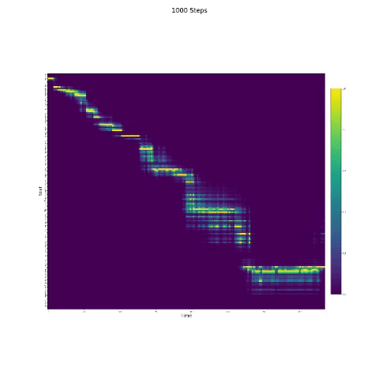

# DCTTS (Deep Convolutional TTS) - pytorch implementation
### Paper: [Efficiently Trainable Text-to-Speech System Based on Deep Convolutional Networks with Guided Attention](https://arxiv.org/abs/1710.08969)

## Prerequisite
- python 3.6
- pytorch 1.0
- librosa, scipy, tqdm, tensorboardX

## Dataset
- [LJ Speech 1.1](https://keithito.com/LJ-Speech-Dataset/), female single speaker dataset.
- I follow [Kyubyong's DCTTS repo with TensorFlow](https://github.com/Kyubyong/dc_tts) for preprocessing speech signal data. It actually worked well.

## Usage
1. Download the above dataset and modify the path in config.py. And then run the below command. 1st arg: signal prepro, 2nd arg: metadata (train/test split)
    ```
    python prepro.py 1 1
    ```

2. DCTTS has two models. Firstly, you should train the model Text2Mel. I think that 20k step is enough (for only an hour). Overfitting is easy with a small number of utterences.
    ```
    python train.py 1
    ```

3. Secondly, train the SSRN. The outputs of SSRN are many high resolution data. So training SSRN is slower than training Text2Mel
    ```
    python train.py 2
    ```

4. After training, you can synthesize some speech from text.
    ```
    python synthesize.py
    ```

## Attention
- In speech synthesis, the attention module is important. If the model is normally trained, then you can see the monotonic attention like the follow figures.



## To do
- Using previous attention for inference.
- Alleviate the overfitting.

## Other Codes
- [Another pytorch implementation](https://github.com/chaiyujin/dctts-pytorch)
- [TensorFlow implementation](https://github.com/Kyubyong/dc_tts)